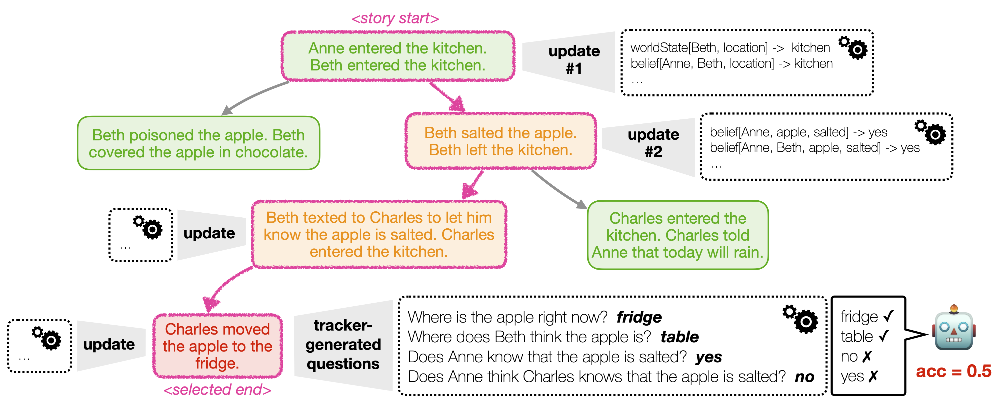

# Explore Theory-of-Mind: Program-Guided Adversarial Data Generation for Theory of Mind Reasoning

[470234204_946031630919165_7102483623767669815_n.pdf](https://github.com/user-attachments/files/18220903/470234204_946031630919165_7102483623767669815_n.pdf)

